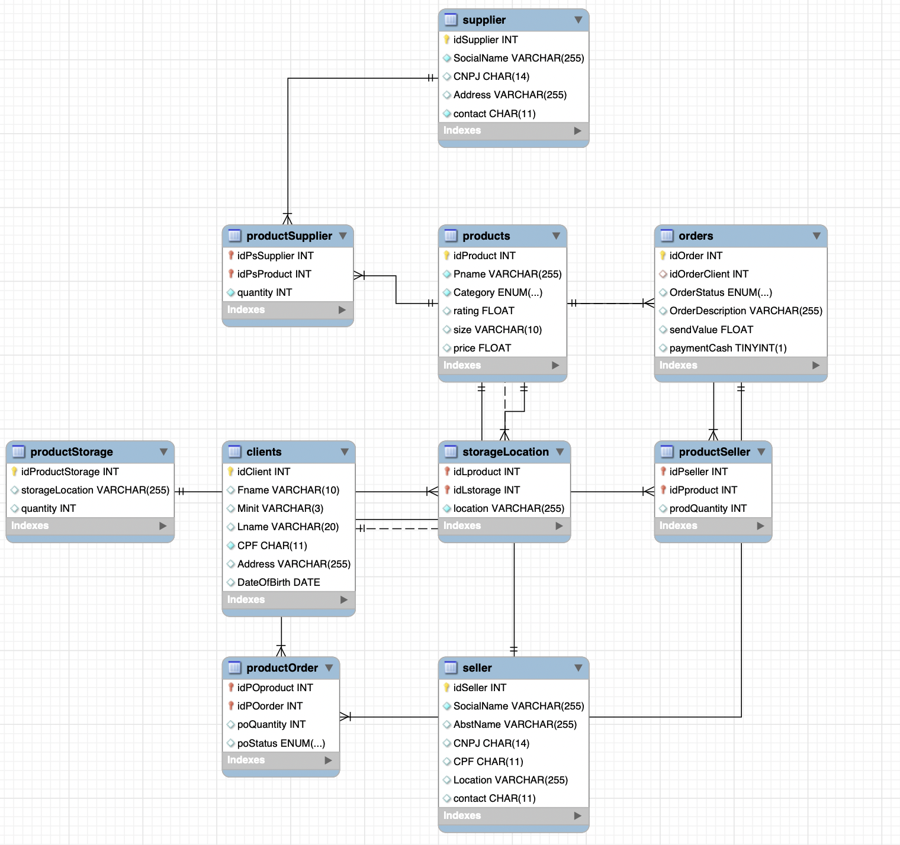
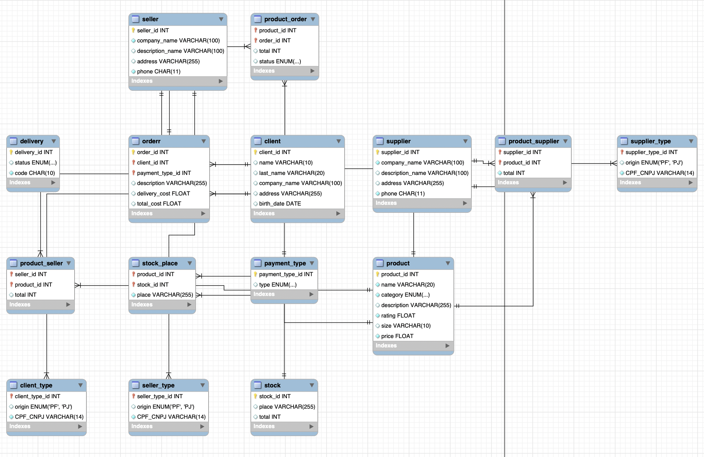

# DIO - Modelagem de Dados com SQL

### Desafios do modulo Modelagem de Dados e Projetos Lógicos na Prática com SQL

Este repositório contém os desafios propostos no módulo de Modelagem de Dados com SQL.

## EER Models

- ecommerce-standart

- ecommerce-refined

